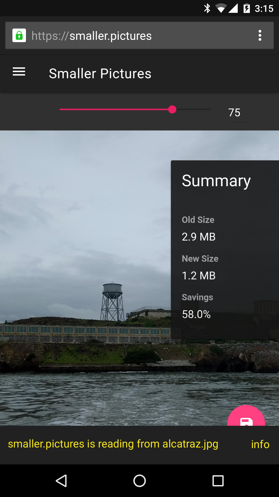

# Interface
The exact interfaces involved here are yet to be decided. But at a high level
what we're providing is several bits:

1. A modernized version of the existing (but not really standardized)
   [`Entry`](https://www.w3.org/TR/2012/WD-file-system-api-20120417/#idl-def-Entry)
   API in the form of new (names TBD) `FileSystemFileHandle` and
   `FileSystemDirectoryHandle` interfaces.
2. A modernized version of the existing (and also not really standardized)
   [`FileWriter`](https://dev.w3.org/2009/dap/file-system/file-writer.html#the-filewriter-interface)
   interface.
3. Various entry points to get a handle representing a limited view of the
   native file system. I.e. either via a file picker, or to get access to
   certain well known directories, or even to get access to the whole native
   file system. Mimicing things such as chrome's
   [`chrome.fileSystem.chooseEntry`](https://developer.chrome.com/apps/fileSystem#method-chooseEntry) API.


# Example code

```javascript
// Show a file picker to open a file.
const file_ref = await FileSystemFileHandle.choose({
    type: 'open',
    accepts: [{description: 'Images', extensions: ['jpg', 'gif', 'png']}],
    suggestedStartLocation: 'pictures-library'
});
if (!file_ref) {
    // User cancelled, or otherwise failed to open a file.
    return;
}

// Read the contents of the file.
const file_reader = new FileReader();
file_reader.onload = () => {
  // ...
};
// file() method can reject if site (no longer) has access to the file.
file_reader.readAsArrayBuffer(await file_ref.file());

// ...

// Write changed contents back to the file. Rejects if file reference is not
// writable.
const file_writer = await file_ref.createWriter();
await file_writer.write(new Blob(['foobar']));
file_writer.seek(1024);
await file_writer.write(new Blob(['bla']));
```

Also possible to store file references in IDB to re-read and write to them later.

```javascript
// Open a db instance to save file references for later sessions
var db;
var request = indexedDB.open("WritableFilesDemo");
request.onerror = function(e) { console.log(e); }
request.onsuccess = function(e) { db = e.target.result; }

// Show file picker UI.
const file_ref = await FileSystemFileHandle.choose();

if (file_ref) {
    // Save the reference to open the file later.
    var transaction = db.transaction(["filerefs"], "readwrite");
    var request = transaction.objectStore("filerefs").add( file_ref );
    request.onsuccess = function(e) { console.log(e); }

    // Do other useful things with the opened file.
};

// ...

// Retrieve a file you've opened before. Show's no filepicker UI.
// The browser can choose when to allow or not allow this open.
var file_id = "123"; // Some logic to determine which file you'd like to open
var transaction = db.transaction(["filerefs"], "readonly");
var request = transaction.objectStore("filerefs").get(file_id);
request.onsuccess = function(e) {
    var ref = e.result;

    // Rejects if file is no longer readable, either because it doesn't exist
    // anymore or because the website no longer has permission to read it.
    var file = await ref.file();
    // ... read from file

    // Rejects if file is no longer writable, because the website no longer has
    // permission to write to it.
    var file_writer = await ref.createWriter({createIfNotExists: true});
    // ... write to file_writer
}
```

Also possible to get access to an entire directory.

```javascript
const dir_ref = await FileSystemDirectoryHandle.choose();
if (!dir_ref) {
    // User cancelled, or otherwise failed to open a directory.
    return;
}
// Read directory contents.
for await (const entry of dir_ref.entries()) {
    // entry is a FileSystemFileHandle or a FileSystemDirectoryHandle.
}

// Get a specific file.
const file_ref = await dir_ref.getFile('foo.js');
// Do something useful with the file.

// Get a subdirectory.
const subdir = await dir_ref.getDirectory('bla', {createIfNotExists: true});

// And you can possibly do stuff like move and/or copy files around.
await file_ref.copyTo(dir_ref, 'new_name', {overwrite: true});

// You can also navigate the file system:
const dir2 = await file_ref.getParent();
// dir2.fullPath == dir_ref.fullPath.
```

And perhaps even possible to get access to certain "well-known" directories,
without showing a file picker, i.e. to get access to all fonts, all photos, or
similar. Could still include some kind of permission prompt if needed.

```javascript
const font_dir = await FileSystemDirectoryHandle.getSystemPath({type: 'fonts'});
for await (const entry of font_dir.entries()) {
    // Use font entry.
};
```

# Proposed security models
The spec has hooks for the browser to customize the security model:

- When to allow files to be opened as `writable`
- When to allow files to be re opened
- When to allow files to be saved

__Native app like__<br>
One proposed security model is to allow sites to always open files as `writable`. Files could be reopened on later visits to the site. If the file had been modified since the last time the site opened it, the browser could show non blocking UI notifying the user:

<div align="center">
    </img>
</div>

When the file is written, the browser could show another non blocking UI notifying the user:

<div align="center">
    </img>
</div>

Alternatively, the browser could choose not to show any UI. This would match the model that users expect from native apps, while restricting the site's actual access only to files that the user has explicitly granted access for.

__More restictive__<br>
Alternatively, the site could choose to only allow files to be `writable` if the user accepts some additional permission (such as a "Allow modifications" checkbox on the filepicker). The non blocking UI mentioned above could be a blocking UI that the user has to accept. The UI could be shown for *any* read, rather than just reads on modified files.

# Known weirdness
- Sites could communicate with each other via a shared file
- Could write a super cookie. __open issue__ Should we clear file access when CBD?
- Sites could bill “save as…” like “download…” but then be able to retain access to it *Could exacerbate super cookie issue from above*
