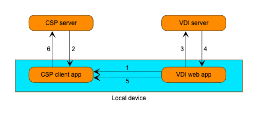
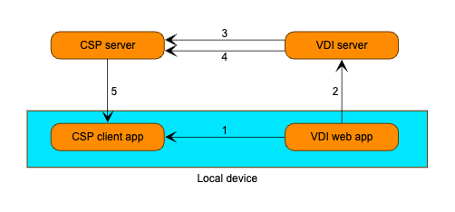
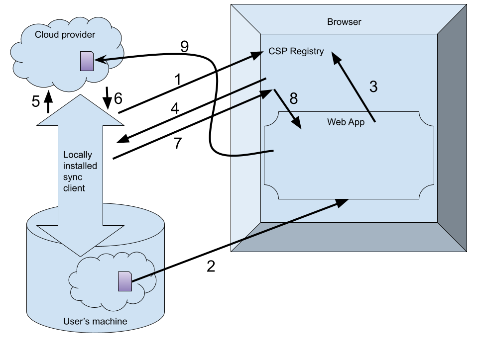

# Cloud Identifier

## Authors:

* Alexander Hendrich (hendrich@chromium.org)

## Participate

* [Issue tracker](https://github.com/WICG/file-system-access/issues)

## Table of Contents

<!-- START doctoc generated TOC please keep comment here to allow auto update -->
<!-- DON'T EDIT THIS SECTION, INSTEAD RE-RUN doctoc TO UPDATE -->

- [Introduction](#introduction)
  - [Sample usage](#sample-usage)
    - [Demo page](#demo-page)
  - [Use Cases](#use-cases)
    - [Remote file handling](#remote-file-handling)
      - [Before](#before)
      - [After](#after)
    - [De-duplication for online document editors](#de-duplication-for-online-document-editors)
    - [Drag \& Drop into Mail](#drag--drop-into-mail)
  - [Non-Goals](#non-goals)
- [Design](#design)
  - [Web IDL](#web-idl)
  - [Interaction with CSP client](#interaction-with-csp-client)
    - [Registration](#registration)
    - [Requesting a cloud identifier](#requesting-a-cloud-identifier)
- [Security and Privacy Considerations](#security-and-privacy-considerations)
  - [Fingerprinting](#fingerprinting)
  - [Modification via read-only permission](#modification-via-read-only-permission)
- [Contributors](#contributors)
- [Stakeholder Feedback / Opposition](#stakeholder-feedback--opposition)

<!-- END doctoc generated TOC please keep comment here to allow auto update -->

## Introduction
The objective of this API is to allow web applications to detect whether a `FileSystemHandle` they have acquired (obtained via file/directory picker or as a parameter of an opening flow as a registered file handler) belongs to a cloud-synced file/directory. If so, the web application receives a “cloud identifier” so that it can directly interact with the file/directory using the cloud storage provider’s (CSP) backend APIs.

A CSP can register as a local sync client to the browser, which in turn may ask the local sync client to provide a unique identifier for a given file/directory when requested.

### Sample usage

```javascript
const [fileHandle] = await window.showOpenFilePicker(pickerOpts);
const cloudIdentifiers = await fileHandle.getCloudIdentifiers();

if(cloudIdentifiers.length === 0) {
  // File is not synced by any CSP
}
for(const cloudIdentifier of cloudIdentifiers) {
  if(cloudIdentifier.providerName === 'drive.google.com') {
    // retrieve/modify the file from Google Drive API using cloudIdentifier.id
  } else if(cloudIdentifier.providerName === 'onedrive.live.com') {
    // retrieve/modify the file from Microsoft OneDrive API using cloudIdentifier.id
  }
}
```

#### Demo page
There is a [demo page](https://cloud-file-handling.glitch.me/) where this API can be tested behind a flag on ChromeOS. Sample usage of that demo page can also be seen with [this recording](https://drive.google.com/file/d/1nrAYOwp9w6JtsKx8XxHkHAVjHyvQG53o/view?usp=sharing).

### Use Cases

#### Remote file handling

Web applications offering app streaming or VDI might want to make a locally synced file available to the remote virtual machine where the app/desktop is being streamed from. For example, the user runs their image editor on a remote machine, launches the file picker to open image.png from the local client device, makes some changes and then saves the file with Ctrl+S.

##### Before



1. VDI web app requests and receives the file via `FileSystemFileHandle.getFile()`
2. CSP client app downloads the file from CSP server (if not already on disc)
3. VDI web app transfers the file’s content to VDI server, which creates it as local file on the server and opens the application for that file
4. VDI server sends any changes made to the file back to the VDI web app
5. VDI web app writes updated file contents via `FileSystemFileHandle.write()`, which is picked up by the CSP client app
6. CSP client app synchronizes the file by uploading it to the CSP server

In this scenario all transfers (arrows in diagram) transfer the entire file and the file has to be downloaded and uploaded from the local device’s network connection.

##### After



1. VDI web app requests and receives the file’s cloud identifier via `FileSystemFileHandle.getCloudIdentifiers()`
2. VDI web app sends the file’s cloud identifier to VDI server
3. VDI server requests and receives the file’s content from CSP server using the cloud identifier
4. VDI server sends any changes made to the file back to the CSP server
5. CSP client synchronizes updated file to local device (might be metadata only)

In this scenario only transfers (3) and (4) would actually transfer the full file, all the other transfers only move the cloud identifier. These actual file transfers also don’t move across the device’s network connection, but rather use the VDI server’s network connection to the CSP server, which should likely also have higher bandwidth.

This reduces network traffic and delays (especially with large files) and prevents version drift (file being modified somewhere else while a local client device is uploading).

#### De-duplication for online document editors

Web-based document editors can already open local files using existing file system APIs. In order to offer full functionality, including cross device support and some advanced editing/sharing features, the documents need to be uploaded to a cloud storage (Google Drive or Microsoft OneDrive or similar) before they can be edited. This leads to duplicate files for documents that were already stored in these locations.

With the proposed changes, the web application could check whether the given file handle is already synced by a cloud storage and generate identifiers for these without a duplicate upload.

#### Drag & Drop into Mail

Sharing files via mail used to be done using simple file attachments. Especially for large files, it is preferable to instead upload them to a CSP and then share an access link to that file to the recipient. Google Mail’s web application, for example, already does this by prompting the user to upload a file to Google Drive when attaching a large file.

With the proposed changes, the web application could already detect that the file is synced by cloud storage and generate a share link for that file’s cloud identifier without requiring the user to manually go through these steps or prompt the user to upload the file to cloud storage again.

### Non-Goals

This proposal does **not** plan to provide a way for web apps to
* provide permission to these files/directories.
* interact (fetch/modify/etc) with these files/directories.
* provide additional meta-data (e.g. sync status)

across various different CSP backend APIs.

This new web API just serves as bridge between the CSP's local sync clients and the web app to retrieve a unique identifier for a file/directory. Obtaining the required permissions on that file/directory or actually reading/writing contents to it via CSP backend API is delegated to the web app's own implementation for each CSP. The `getCloudIdentifiers()` might also return `FileSystemCloudIdentifier`s for CSPs the web app does not support.

## Design



1. Locally installed CSP client registers itself as a provider for certain directories with the browser
2. Web app receives `FileSystemHandle` for a file/directory (via File Handling opening flow, File System Access file/directory picker or drag & drop) and requests its cloud identifier(s) via `getCloudIdentifiers()`.
3. Browser checks whether this path has been registered as being synced by a local sync client
   * If no, resolve promise with empty list
4. For each registered local sync client for that path, the browser will send a request to the registered local sync client's executable with the file’s/directory’s path
5. Local sync client requests a token for that path from the CSP
6.  CSP can choose to generate a one-time token or stable identifier to later be used by the CSP’s backend APIs. Either way, the properties of the token are up to the CSP and completely opaque to the browser.
7. Local sync client responds to browser with the token
8. Browser gathers all responses from registered local sync clients. For all incoming responses, the browser will construct a cloud identifier consisting of the responding local sync client's registered identifier and the provided token. Once all registered local sync clients for that path have responded, the promise is resolved with a list of cloud identifiers. If the local sync client fails to respond within a reasonable time frame, the promise is resolved with all received cloud identifiers until then or empty list if none.
9. Web app can freely interact with CSP’s backend APIs on that file/directory. The web application is responsible for getting the right access permissions for these web APIs.

### Web IDL

This section describes the interface the web app would interact with.

```idl
dictionary FileSystemCloudIdentifier {
  DOMString providerName;
  DOMString id;
};

partial interface FileSystemHandle {
  Promise<FileSystemCloudIdentifier[]> getCloudIdentifiers();
}
```

The new method
* extends `FileSystemHandle`, i.e. is available for files and directories.
* returns a list of `FileSystemCloudIdentifier`s since a single file/directory can be synced by multiple CSPs at the same time, although in most cases this list would only contain a single entry.
* returns an empty list if the file/directory is not synced by any CSPs or no CSP client responded in time.

### Interaction with CSP client

This web API requires the browser and the CSP’s local sync client to exchange information. This piece is not part of the official specification and up to individual browser’s to implement, but we can provide guidelines here as well.

#### Registration

The browser needs to be aware of 
* which CSP client’s are available on the user’s computer
* which files/directories are synced by the CSP client
* where the CSP client executable is located 
* the CSP’s identifier (e.g. “com.google.drive”)

Therefore, the CSP needs to provide a JSON file containing these details and register it with the browser at a known location (specific directory or registry key), similar to [Chrome extension’s native messaging host registration](https://developer.chrome.com/docs/apps/nativeMessaging/#native-messaging-host-location).

The provided file would look like this:

```json
{
  "name": "com.foo-company.drive",
  "path": "C:\\Program Files\\FooCompany\\cloud_storage_provider_helper.exe",
  "synced_paths": [
    "C:\\path_to_synced_directory\\",
    "C:\\path_to_other_synced_directory\\",
  ]
}
```

#### Requesting a cloud identifier

Whenever a web app calls `getCloudIdentifiers()`, the browser will iterate through all registered CSP clients and filter for ones that cover the file’s/directory’s path as part of their `synced_paths`.

For these, the browser will launch the executable at `path` and transfer the web app’s origin and the requested file/directory path, either via command line argument or via stdin (preceded with a 32-bit message length).

The CSP client will then respond with the token for the given file/directory via stdout (preceded with a 32-bit message length).

Once the browser has received all responses (or some reasonable timeout has expired), the browser will bundle the individual tokens and the CSPs’ names together to return a cloud identifier.

It is up to each individual browser’s implementation on how they handle dynamic registrations, i.e. whether they re-read all the CSP registration files for each request and how long or if they cache them.

## Security and Privacy Considerations

### Fingerprinting

The browser has no control whether the CSP will provide one-time tokens or stable identifiers as part of their cloud identifier. If the CSP provides stable identifiers, the web application could use these as a [fingerprinting](https://www.w3.org/TR/fingerprinting-guidance/#dfn-active-fingerprinting) mechanism for the files/directories it has access to.

In theory, if a web application already has access to a `FileSystemHandle` the web application could already use other mechanisms to generate fingerprinting identifiers, but these are less stable:
* Hashing the file’s/directory’s contents -> identifier will change if file/directory content changes
* `FileSystemHandle.getUniqueId()` [[explainer](https://github.com/whatwg/fs/pull/46)] -> clearing browsing data will reset unique IDs

The web application would need repeated access to the same `FileSystemHandle` to perform this fingerprinting though. That means the user must either re-grant access to the same file or the web app stores the file handle in an IndexedDB, which can be cleared by the user though by clearing their browsing data.

It would also be up to the CSP whether they actually provide permanent tokens or temporary tokens.

### Modification via read-only permission

If a web application only has `read` [permission](https://wicg.github.io/file-system-access/#enumdef-filesystempermissionmode) to a `FileSystemHandle`, but has edit/write permission to that file via CSP backend APIs, it could still modify the cloud-stored file, which is then synced to the device and thereby modify the file. 

In this case, the user has clearly granted write access to the CSP-backed file and by having a sync client, the user also allows the local files to be modified, so the change would actually not be surprising.

## Contributors

* Austin Sullivan (asully@chromium.org)
* Rob Beard (rbeard@google.com)

## Stakeholder Feedback / Opposition

* Web developer: [positive](https://github.com/WICG/file-system-access/pull/411#issuecomment-1609676416)
